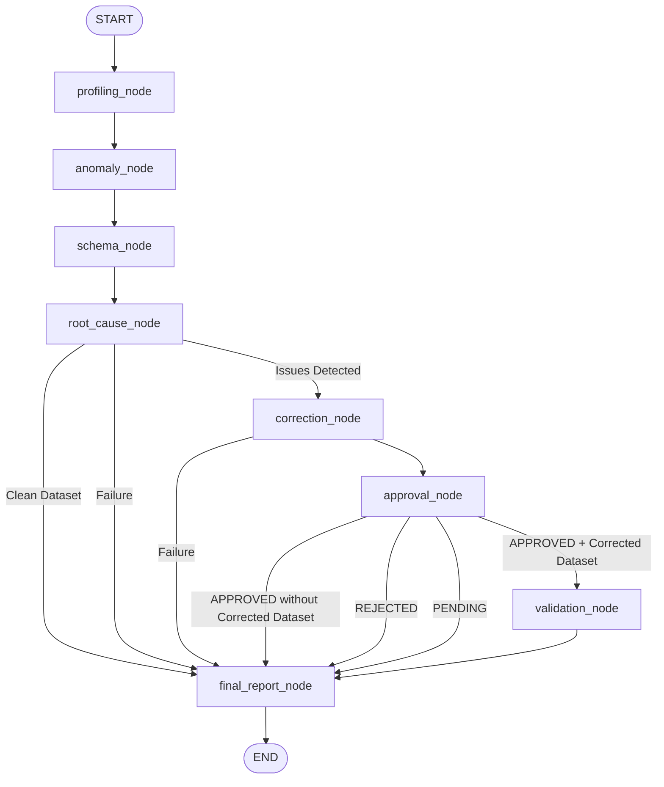

# Phase 9 — LangGraph Multi-Agent Orchestration

This document details the architecture, design principles, state schema, node execution, and conditional routing of the **LangGraph Orchestration Loop** for the Autonomous Data Quality Investigation Agent.

---

## 1. Why LangGraph?

The Autonomous Data Quality Investigation Agent combines multiple specialized diagnostic agents:
1. **Data Profiling Agent** (Phase 3)
2. **Anomaly Detection Agent** (Phase 4)
3. **Schema Analysis Agent** (Phase 5)
4. **Root Cause Investigation Agent** (Phase 6)
5. **Correction Recommendation Agent** (Phase 7)
6. **Validation Agent** (Phase 8)

While each agent operates independently as a deterministic tool with optional LLM narrative synthesis, complex data quality investigations require **structured multi-step execution**, **conditional workflow branching**, **human-in-the-loop control**, and **state transparency**.

**LangGraph provides:**
- **Explicit Directed Graph Control**: Deterministic graph transitions instead of uncontrolled LLM loops.
- **Shared Immutable State**: Seamless data pass-through between upstream diagnostic tools and downstream synthesis agents without redundant re-computation.
- **Conditional Routing**: Early termination when datasets are clean (`NO_CORRECTION_REQUIRED`), and explicit human decision branching (`APPROVED`, `REJECTED`, `PENDING`).
- **Safety Boundaries**: The workflow strictly separates diagnostic recommendation from data remediation and validation.

---

## 2. Shared LangGraph State

Defined in [`app/graph/state.py`](file:///c:/projects/SB%20projects/Autonomous%20Data%20Quality%20Investigation%20Agent/autonomous-data-quality-agent/app/graph/state.py):

```python
class InvestigationState(TypedDict, total=False):
    # Inputs
    dataset_path: str
    dataset_name: Optional[str]
    schema_name: Union[str, Dict[str, Any]]
    corrected_dataset_path: Optional[str]
    approval_status: str  # "APPROVED", "REJECTED", "PENDING", "NOT_REQUIRED"
    use_llm: bool

    # Diagnostic Agent Outputs
    profiling_result: Optional[AgentProfilingResponse]
    anomaly_result: Optional[AgentAnomalyResponse]
    schema_result: Optional[AgentSchemaResponse]
    root_cause_result: Optional[AgentRootCauseResponse]
    correction_result: Optional[AgentCorrectionResponse]
    validation_result: Optional[AgentValidationResponse]

    # Final Report Output
    final_report: Optional[Dict[str, Any]]

    # Workflow Metadata & Diagnostics
    workflow_status: str  # "RUNNING", "COMPLETED", "NO_CORRECTION_REQUIRED", "REJECTED", "PENDING_APPROVAL", "FAILED"
    errors: List[Dict[str, Any]]
    execution_trace: List[Dict[str, Any]]
```

---

## 3. Workflow Graph Architecture



---

## 4. Workflow Nodes

Implemented in [`app/graph/nodes.py`](file:///c:/projects/SB%20projects/Autonomous%20Data%20Quality%20Investigation%20Agent/autonomous-data-quality-agent/app/graph/nodes.py):

| Node | Responsibilities | Output State Field |
| :--- | :--- | :--- |
| `profiling_node` | Executes Phase 3 Data Profiling Agent. | `profiling_result` |
| `anomaly_node` | Executes Phase 4 Anomaly Detection Agent. | `anomaly_result` |
| `schema_node` | Executes Phase 5 Schema Analysis Agent against expected schema. | `schema_result` |
| `root_cause_node` | Executes Phase 6 Root Cause Agent, correlating upstream evidence. | `root_cause_result` |
| `correction_node` | Executes Phase 7 Correction Agent to synthesize remediation plan. | `correction_result` |
| `approval_node` | Evaluates human decision (`APPROVED`, `REJECTED`, `PENDING`). | `approval_status`, `workflow_status` |
| `validation_node` | Executes Phase 8 Validation Agent on post-correction dataset. | `validation_result` |
| `final_report_node`| Compiles comprehensive structured report from graph state. | `final_report`, `workflow_status` |

---

## 5. Conditional Routing Logic

Defined in [`app/graph/workflow.py`](file:///c:/projects/SB%20projects/Autonomous%20Data%20Quality%20Investigation%20Agent/autonomous-data-quality-agent/app/graph/workflow.py):

### 1. Clean Data Routing (`route_after_root_cause`)
If the Root Cause Agent reports `investigation_status == "no_issues_detected"` or zero diagnostic anomalies:
- The graph transitions directly to `final_report_node`.
- Correction and validation nodes are skipped.
- `workflow_status` is marked as `NO_CORRECTION_REQUIRED`.

### 2. Human Approval & Validation Routing (`route_after_approval`)
- **`APPROVED` + `corrected_dataset_path`**: Routes to `validation_node` to independently verify remediations.
- **`APPROVED` (no corrected dataset)**: Routes to `final_report_node` (validation skipped safely).
- **`REJECTED`**: Routes to `final_report_node` with status `REJECTED`.
- **`PENDING`**: Routes to `final_report_node` with status `PENDING_APPROVAL`.

### 3. Fail-Safe Error Routing
If any agent or node throws an unhandled exception:
- The error is captured in `errors`.
- `workflow_status` is updated to `FAILED`.
- The conditional routers automatically route to `final_report_node`, preserving all previous successful stage findings.

---

## 6. Execution Trace

The execution trace maintains a chronological list of node steps:

```json
[
  { "node": "profiling_node", "status": "completed" },
  { "node": "anomaly_node", "status": "completed" },
  { "node": "schema_node", "status": "completed" },
  { "node": "root_cause_node", "status": "completed" },
  { "node": "correction_node", "status": "completed" },
  { "node": "approval_node", "status": "approved" },
  { "node": "validation_node", "status": "completed" },
  { "node": "final_report_node", "status": "completed" }
]
```

---

## 7. Safety & Non-Destructive Principles

1. **Read-Only Operation**: The workflow only reads input datasets. Raw files (such as `data/raw/sales_problematic.csv`) are never modified or deleted.
2. **Recommendation-Only Remediation**: The workflow generates correction action plans with risk ratings and approval requirements; it never autonomously mutates production databases.
3. **Isolated Validation**: Validation is performed strictly against a separately supplied post-correction file.

---

## 8. CLI Usage

### Basic Investigation (Pending Approval Default)
```bash
python -m app.graph.workflow data/raw/sales_problematic.csv
```

### Approved Investigation with Corrected Dataset
```bash
python -m app.graph.workflow data/raw/sales_problematic.csv \
  --approval-status APPROVED \
  --corrected-dataset-path data/test/fully_corrected.csv
```

### Clean Dataset Run with Verbose Trace
```bash
python -m app.graph.workflow data/raw/sales_clean.csv --verbose
```

### Deterministic Run without LLM
```bash
python -m app.graph.workflow data/raw/sales_problematic.csv --no-llm
```

---

## 9. Programmatic Python API

```python
from app.graph.workflow import run_data_quality_workflow

# 1. Investigate dataset
result = run_data_quality_workflow(
    dataset_path="data/raw/sales_problematic.csv",
    approval_status="APPROVED",
    corrected_dataset_path="data/test/temp_corrected.csv",
    use_llm=True,
)

# 2. Access final report
report = result["final_report"]
print(report["workflow_status"])
print(report["root_cause"]["primary_cause"])
print(report["validation_status"]["verdict"])
```
